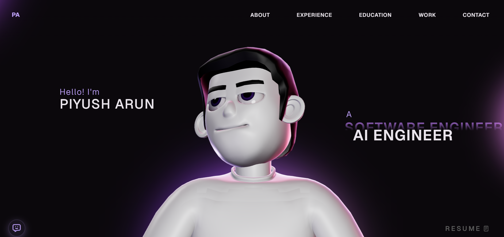

# 🚀 Interactive 3D Software Engineer (AI) Portfolio

A state-of-the-art, high-performance **3D Portfolio** featuring an interactive 3D avatar workspace, a custom smooth-scrolling experience and an integrated AI chatbot assistant. Built with **React**, **TypeScript**, **Three.js (React Three Fiber)**, **GSAP**, and **Lenis**.



---

## 🌟 Key Features

*   **🎮 Interactive 3D Workspace:** Powered by **Three.js** and **React Three Fiber**, showcasing a detailed 3D setup with dynamic camera movements, reactive screen lights, and smooth controls.
*   **🤖 AI Chatbot Assistant:** A custom intelligent chat widget integrated directly into the portfolio to guide visitors, answer questions, and showcase agentic AI capabilities.
*   **✨ Smooth Scrolling & Page Animations:** Powered by **Lenis** and **GSAP ScrollTrigger** for responsive scrolling timelines and text splitting effects.
*   **⚙️ Config-Driven Layout:** All text, projects, experiences, and social links are centralized in a single file (`src/config.ts`), making customization seamless.
*   **📱 Fully Responsive:** Fully optimized for mobile and desktop viewports, disabling resource-heavy 3D assets on smaller viewports for faster performance.

---

## 🛠️ Tech Stack

*   **Frontend Core:** React 18, TypeScript, Vite, CSS
*   **3D Graphics:** React Three Fiber, `@react-three/drei`, Three.js
*   **Physics & Mathematics:** Three-stdlib, `@react-three/cannon` / `@react-three/rapier`
*   **Animations:** GSAP (GreenSock Animation Platform) + ScrollTrigger
*   **Smooth Scroll:** Lenis Scroll Engine
---

## 🚀 Getting Started

### 1. Clone the repository
```bash
git clone https://github.com/arunpiyush25/portfolio-website.git
cd portfolio-website
```

### 2. Install dependencies
```bash
npm install
```

### 3. Setup Environment Variables
Create a `.env` file in the root directory (based on `.env.example`):
```env
VITE_CHATBOT_API_URL=your_api_url_here
```

### 4. Run the development server
```bash
npm run dev
```

### 5. Build for Production
```bash
npm run build
```

---

## ⚙️ How to Customize

All content in the portfolio is managed through a single configuration file. Open [src/config.ts](file:///c:/Users/ASUS/Portfolio-Website/src/config.ts) to edit:

1.  **Developer Information:** Edit your name, role description, and titles.
2.  **Experiences & Education:** Add your career milestone items, descriptions, and list of technologies.
3.  **Projects:** Insert your portfolio items including images, descriptions, categories, and links.
4.  **Contact:** Set your email, social profile links, and configure your Web3Forms token for the contact form.
5.  **Skills:** Modify the core skill blocks and tag lists.

---

## 🤝 Connect

*   **GitHub:** [arunpiyush25](https://github.com/arunpiyush25)
*   **LinkedIn:** [Piyush Arun](https://linkedin.com/in/piyushkumararun)
*   **Email:** arunpiyush10@gmail.com

---

## 🪪 License

This project is open-source and licensed under the **MIT License**. See [LICENSE](LICENSE) for details.
